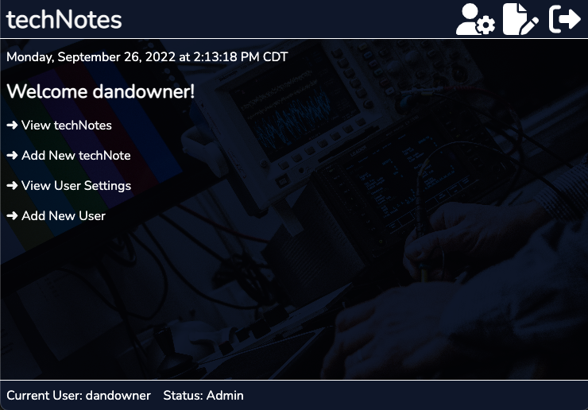
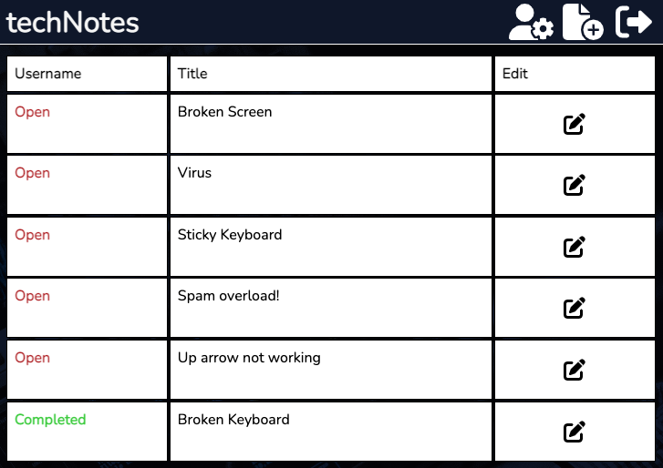
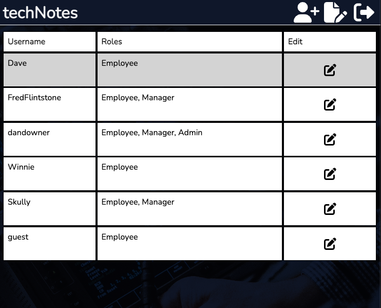

# TechNotes

An application made for the staff of Dan D. Repairs computer repair shop, with various permissions based on staff role. Employee's can login, create and update their assigned repair notes. Managers and admin's also have the ability to view all notes, delete notes, add users, and edit user status. This application utilizes RTK Query to manage data fetching and caching.



Above: *User Dashboard*



Above: *Notes Table*



Above: *User Settings*

## Browse website

* To browse the website as a guest employee, go to <https://technotes-80g1.onrender.com/>, click employee login at the bottom of the page, and enter the following user creditials:
  * Username: guest
  * Password: guest12345
* Please note this login only has employee access, so you will only be able to create notes and edit your assigned notes.

## Further Development

This project is currently set up for production. In order to make updates in development, please do the following after downloading the code to your local environment:

* Confirm you have Node.js installed.
* Create a free [Mongo Atlas](https://www.mongodb.com/atlas/database) database online or start a local MongoDB database.
* Create a `.env` file in the backend directory. Within the `.env` file:
  * Create a `DATABASE_URI` property and set it to your MongoDB connection string.
  * Create a unqine access token secret and refresh token secret and add to `ACCESS_TOKEN_SECRET` and `REFRESH_TOKEN_SECRET` properties.
  * Set `NODE_ENV` property to 'development'.
* Find the `allowedOrigins.js` file within the config directory in the backend directory. Add <http://localhost:3000> to the allowedOrigins array.
* In the frontend directory, find the apiSlice.js file nested within the src, app, and api directories. Update the baseUrl value within baseQuery to <http://localhost:3500>
* Run `npm install` in the terminal of both the frontend and backend directories.
* Use an API platform such as Postman to create users in order to login to the app. Users will need a username and password property. To create a user that can edit user settings on app, also include roles property of ["Admin"] or ["Manager"].
  * Ex. Create a POST request in Postman to the <http://localhost:3500/users> endpoint with the following in the body (JSON):

  ```json
  {
    "username": "dandowner",
    "password": "abc123",
    "roles": ["Admin"]
  }
  ```

## Running the Project

* In the frontend directory in the terminal, enter: `npm start` to get the frontend code running.
* In the backend directory in the terminal, enter: `npm run dev` to connect to the database and get the server running.
* Browse the website at [localhost:3000](http://localhost:3000)
